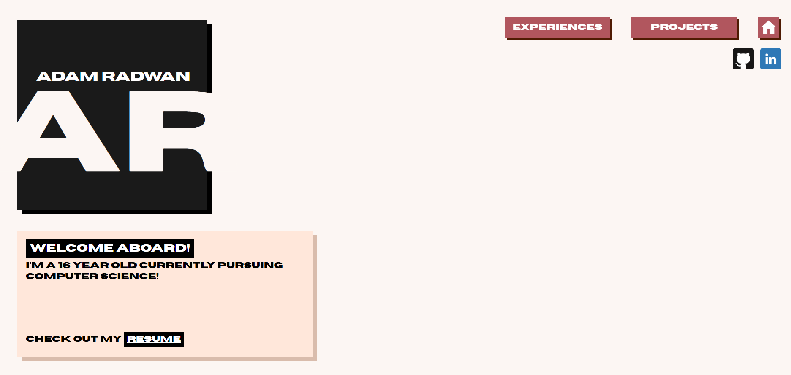

# portfolio-website
My official website! Made using VSCode with the programming languages HTML and CSS!

This was the first project I really spent time taking on, meaning there is expected bugs and technical difficulties I either have found and am trying to fix, or haven't found yet (sorry!)

Feel free to either download the repository and check out the code yourself, or skip all those steps and check out the <a href="https://adamradwan.netlify.app/">website on Netlify!</a> 
